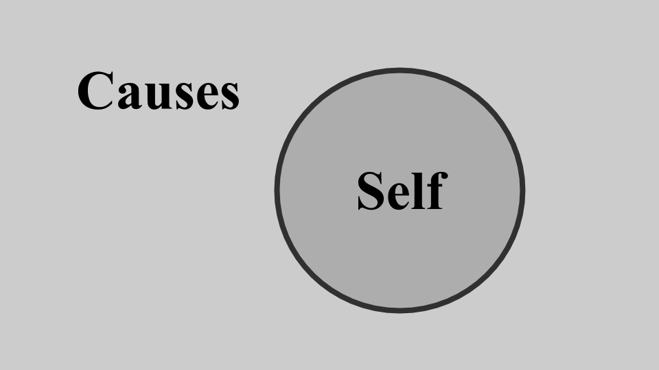
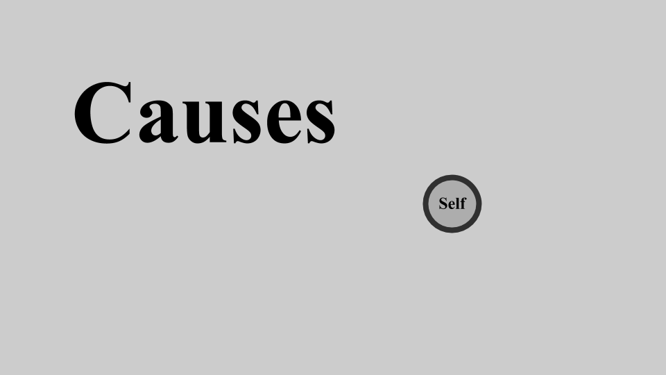
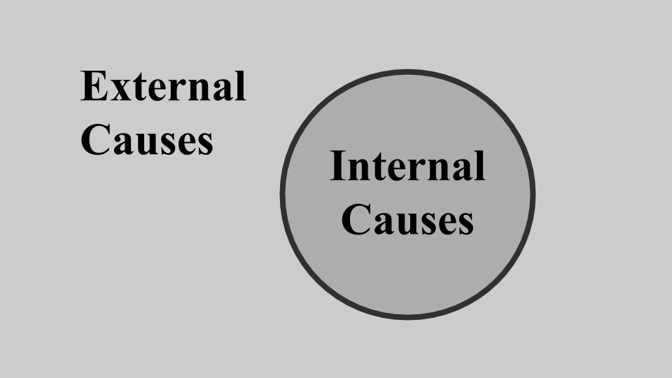

# At the heart of the wood

People talk about causes as if they exist outside ourselves, a free centre of the universe. Like this:

And with every discovery that something external influences our choices - whether something about the brain, or something about society - the free space is threatened and shrinks:

But it isn't like this. What I've been trying to argue here is that the rule of causes is compatible with free, interesting choices. There is novelty, surprise, variety in complex determinism. All the things you need for a free will worth wanting.

I find it is more helpful to think of external and internal causes:

And, actually, these internal causes come in all different kinds, one of which is that they persist over time:

Your choices are free because they are yours, not because they are indepenedent of you or other structures in the world. 

With this view of free will and the self, details about the brain show us another side of things, they don't necessarily shrink the space within which the self exists. And just because the brain is a physical object, and neural signals have some kind of stable measurement, doesn't mean that ideas and meaning don't have an equally powerful role patterning our choices.

We may be deterministic machines in a deterministic universe, but we are complex systems which carry a non-reducible nexus of causes with us - in our unique history, and unique position in the buzzing-blooming confusion of the environment. Our actions may be compelled, but they are in part compelled by personal causes. Those personal causes make up what we call our selves.

This is the kind of freedom worth wanting, to choose because of who you are.

&#9744; &#9744;

END

&#9744; &#9744;

To learn about who worked on this project, tweet @ChoiceEngine [CREDITS](https://twitter.com/intent/tweet?text=@ChoiceEngine%20CREDITS)

If you'd like links to further reading on these topics [READING](https://twitter.com/intent/tweet?text=@ChoiceEngine%20READING)