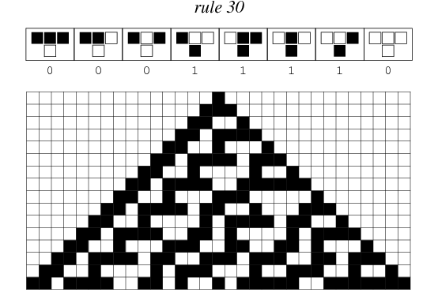

# Complexity

Imagine, a row squares, like the top row of a chess board. Each square, which I'll call a cell, has one of two possible states. You can think of these as "on" and "off", or 0 and 1 if you prefer, but I'm going to refer to them as "black" and "white". In this strip, each cell changes according to a simple rule which takes account of only three things - that cell's current state (black or white) and the current state of the two cells either side.

We have now [defined a universe](http://en.wikipedia.org/wiki/Cellular_automaton) over which we have complete knowledge of the state of everything in it (simple really, each cell is either black or white) and also the 'laws of physics' which determine change between states.

If you do the maths, there is a relatively small set of possible rules. There are 8 possible input states (each rule considers only 3 cells, and each cell has only 2 possible states = 23 input states), and for each input state one of the two possible output states is declared. 

So, for example, if a cell is black, and its two neighbours are both black, the rule could specify that the cell then turns white. If, for all other combinations of input states, the rules also specified that the cell turns white, then we'd have laws of physics that pretty soon made the whole strip white, however it started out. That is one possible, uninteresting, rule.

[Stephen Wolfram](http://vserver1.cscs.lsa.umich.edu/~crshalizi/reviews/wolfram/) came up with a numbering system for all the possible rules. It turns out that many rules are very boring (everything goes black or everything goes white), some are marginally interesting (you get patterns that repeat, for example), and a small minority are super-interesting. 

Visualising the way the cellular automaton changes over time is made easier if you put each successive state of the strip below the previous one, creating a 2D grid in which changes propagate downwards. Here is a picture of this, where the cells change according to '[Rule 30](http://en.wikipedia.org/wiki/Rule_30)' in Wolfram's numbering scheme. The grid world starts with a single cell which is black and all the rest white, and the changes are written in successful rows stretching below the top row.

 
Image credit: [Wolfram Mathworld](http://mathworld.wolfram.com/Rule30.html)

From a single initial black square you can see the strip changes so that more and more of the cells are black. But most interesting is that the state of the cells seems to randomly explore the space between being completely black and completely white. Not only is it unpredictable how individual cells are going to change in the future, but but you get interesting patterns across groups of cells. Notice the triangles of different sizes that begin appearing (you can see the biggest one on the right about half-way down).

What happens to this pattern if we continue applying the rule? It doesn't settle into a stable state, but continues generating more black and white space, and more triangles:

 
Image credit: Made in Processing, modifying [code](https://pastebin.com/vyQ0fkxj-) by [Fabienne Serrière](https://twitter.com/fbz).

&#9744; &#9744;

Next up: what this means [CHAOS](https://twitter.com/intent/tweet?text=@ChoiceEngine%20CHAOS)

